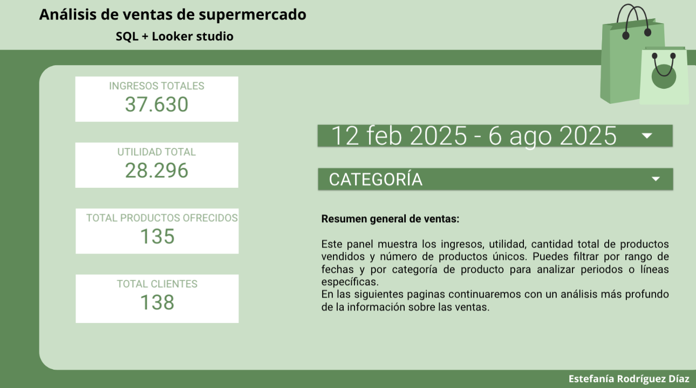

# 🛒 Supermarket Sales Analysis

En este proyecto se presenta el análisis de ventas de un supermercado ficticio con el objetivo del análisis es extraer información valiosa a través de consultas en SQL y visualizaciones de los resultados con un dashboard interactivo en Looker Studio. Abarca fechas desde enero 2023 hasta junio 2025.

---

## Objetivos del proyecto

- Analizar ingresos y utilidad total del negocio
- Detectar los productos más rentables y con mayor utilidad
- Identificar a los clientes más y menos valiosos por utilidad generada
- Visualizar el comportamiento temporal de las ventas y utilidades
- Crear un dashboard interactivo, claro y profesional para toma de decisiones

---

## Herramientas utilizadas

- **MySQL**: consultas y agregaciones de datos
- **Looker Studio**: visualización de datos y construcción del dashboard
- **Google Sheets**: limpieza y preparación de los datos

---

## Consultas realizadas en SQL

Puedes ver las consultas SQL en el archivo [`sql_queries.sql`](sql_queries.sql)

---

## Visualizaciones incluidas en el dashboard

- Indicadores clave: ingresos, utilidad, total de productos, total de clientes
- Top 10 productos por utilidad y por margen
- Análisis de utilidad mensual por año
- Clientes con mayor y menor utilidad generada
- Filtros interactivos por rango de fechas y categoría de producto

---

## Vista previa

 

## Vista en linea
🔗 **[Ver dashboard en línea](https://lookerstudio.google.com/reporting/dadadcde-f922-4a88-96cf-bbf7d6fb6a0b)**  

